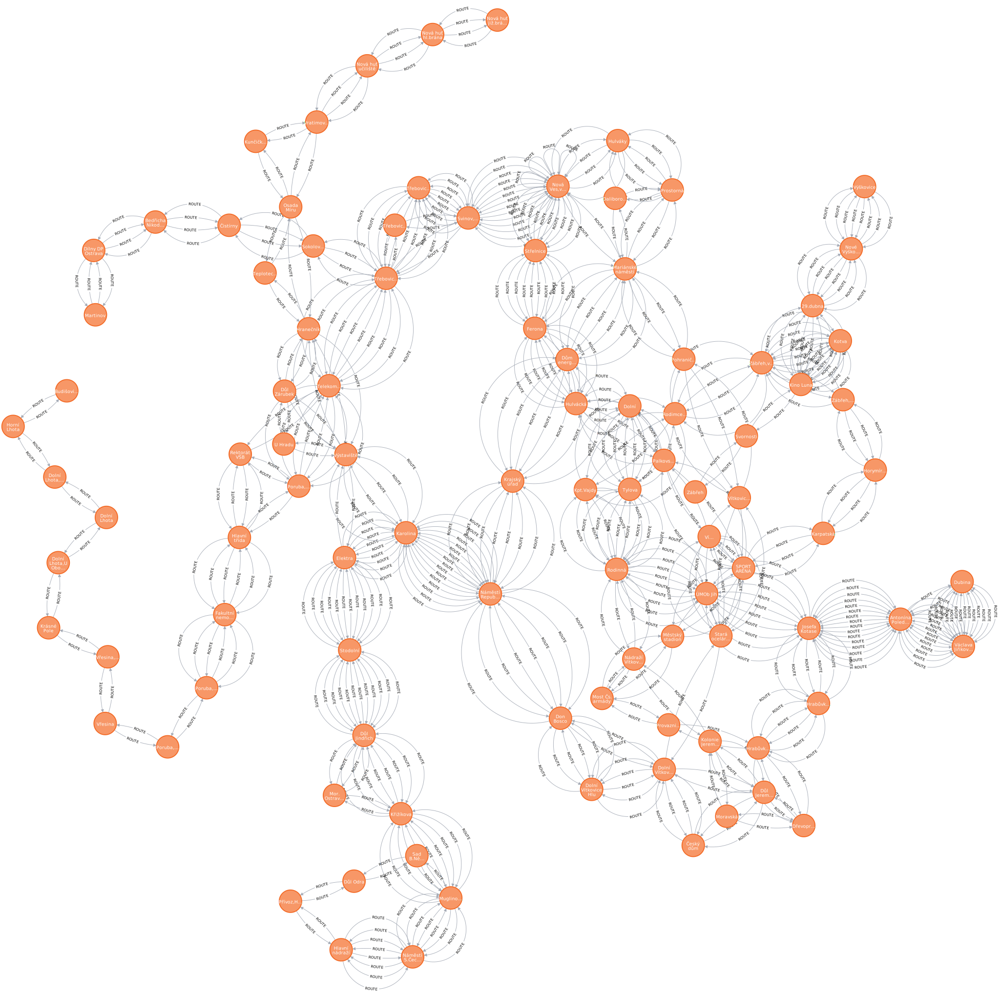
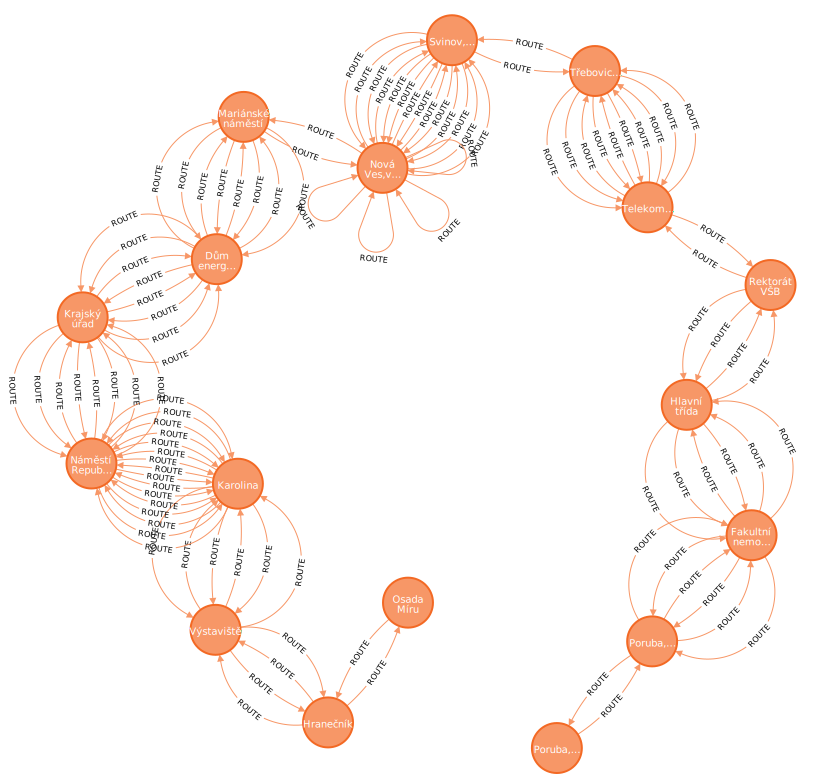

# Projekt, 2. část: ukládání rozsáhlých dat v NoSQL databázích

Autoři: Jakub Vlk (xvlkja07), Adam Zvara (xzvara01)

# Databáze neo4j - grafová databáze

**Název:** Zastávky MHD ve Statutárním městě Ostrava
**Odkazy:**
https://data.gov.cz/datov%C3%A1-sada?iri=https%3A%2F%2Fdata.gov.cz%2Fzdroj%2Fdatov%C3%A9-sady%2F00845451%2F37085532
<br>**Distribuce:** GeoJSON<br>
**Druh databáze:** neo4j<br>
**Pro úplnost zde uvádím data tak, jak jsem je získala z Wikipedie:** V souboru `lines.txt` je seznam linek

Pro grafové databáze se hodí především taková data, nad kterými chceme provádět grafové algoritmy. V případě našich dat
se jedná o přirozenou reprezentaci vztahů o existenci cest mezi zastávkami. Neo4j má v sobě implementováno spoustu grafových
algoritmů, které můžeme využít pro analýzu dat. Díky tomu můžeme snadno zjistit například nejkratší cestu mezi dvěma
zastávkami.

Předpokládá se využití databáze pro analýzu cestování v rámci města Ostravy. To znamená, jaké cesty existují mezi dvěma
zastávkami. Tento problém je zjevně grafový, a proto se pro něj výborně hodí grafová databáze.

Vzhledem k tomu, že data jsou v nestrojově zpracované podobě, je třeba je nejprve zpracovat. Pro zpracování dat jsme
použili Python script, který data zpracoval a vytvořil přímo Cypher script pro vložení dat do neo4j databáze.

Největším problémem byla data od Dopravního podniku Ostrava. Opakovaně se stalo, že některé zastávky nebyly v datech, i
když prokazatelně existují. Časté byly i nesoulady mezi názvy zastávek (např. zastávka pro tramvaje měla jiné
jméno než zastávka pro autobusy -- jiné mezery, zkrácené-nezkrácené texty apod.) nebo nesoulady mezi jmény v jízdních
řádech a datovou sadou (ověřeno z několika zdrojů). Nebo to, že ne všechny tramvajové zastávky jsou tramvajové. Data bylo
tedy potřeba projít a ručně vyčistit a doplnit, což
zabralo hodně času.

**Postup pro vložení dat do neo4j databáze je následující:**

1. Parsování dat z Wikipedie
    - Pouze rozdělení jednotlivých zastávek díky `-` a následné odstranění zbytečných znaků (mezer, tabulátorů).
2. Propojení dat z Wikipedie a z dat Dopravního podniku Ostrava
    - Ruční kontrola a doplnění chybějících zastávek
    - Ruční kontrola a oprava názvů zastávek
    - Propojení dat z Wikipedie a z dat Dopravního podniku Ostrava
3. Vytvoření zastávek
    - Pro každou zastávku vytvořit nový uzel s názvem zastávky, souřadnicemi a informací o tom, zda je přístupná pro
      vozíčkáře.
4. Propojení všech zastávek hranou, pokud existuje cesta mezi nimi (oběma směry, aby byl graf neorientovaný).

## Vložení a definice schématu

```sql
/* Create all stops */
CREATE
CONSTRAINT stop_name IF NOT EXISTS FOR (s:Stop) REQUIRE s.name IS UNIQUE;

UNWIND
[
 {name: 'Hlavní nádraží',location: point({longitude: 18.268441009548248, latitude: 18.268441009548248}), wheelchair_accessible: False},
{name: 'Náměstí S.Čecha',location: point({longitude: 18.272677009208753, latitude: 18.272677009208753}), wheelchair_accessible: False},
{name: 'Muglinovská',location: point({longitude: 18.278012008641852, latitude: 18.278012008641852}), wheelchair_accessible: True},
       /* ... Ostaní zastávky... */
{name: 'U Hradu',location: point({longitude: 18.296669009450927, latitude: 18.296669009450927}), wheelchair_accessible: True},
{name: 'Daliborova',location: point({longitude: 18.254088009084025, latitude: 18.254088009084025}), wheelchair_accessible: False},
{name: 'Kunčičky,kostel',location: point({longitude: 18.30481100852727, latitude: 18.30481100852727}), wheelchair_accessible: False}
] AS stop

        CREATE
(s:Stop {
            name: stop.name,
            location: point({longitude: stop.longitude, latitude: stop.latitude}),
            wheelchair_accessible: stop.wheelchair_accessible
                }
                )
            WITH s
            RETURN count(*);
            
        
       
/* Create route 1 and its connections */
// Create
connections for route 1
MATCH (s0:Stop {name: 'Hlavní nádraží'})
MATCH (s1:Stop {name: 'Náměstí S.Čecha'})
MATCH (s2:Stop {name: 'Muglinovská'})
MATCH (s3:Stop {name: 'Křižíkova'})
MATCH (s4:Stop {name: 'Důl Jindřich'})
MATCH (s5:Stop {name: 'Stodolní'})
MATCH (s6:Stop {name: 'Elektra'})
MATCH (s7:Stop {name: 'Karolina'})
MATCH (s8:Stop {name: 'Náměstí Republiky'})
MATCH (s9:Stop {name: 'Don Bosco'})
MATCH (s10:Stop {name: 'Dolní Vítkovice Hlubina'})
MATCH (s11:Stop {name: 'Dolní Vítkovice'})
MATCH (s12:Stop {name: 'Český dům'})
MATCH (s13:Stop {name: 'Důl Jeremenko'})
MATCH (s14:Stop {name: 'Kolonie Jeremenko'})
MATCH (s15:Stop {name: 'Moravská'})
MATCH (s16:Stop {name: 'Dřevoprodej'})
MATCH (s17:Stop {name: 'Hrabůvka,kostel'})
MATCH (s18:Stop {name: 'Hrabůvka,Poliklinika'})
MATCH (s19:Stop {name: 'Josefa Kotase'})
MATCH (s20:Stop {name: 'Antonína Poledníka'})
MATCH (s21:Stop {name: 'Václava Jiřikovského'})
MATCH (s22:Stop {name: 'Dubina'})
CREATE
(s0)-[:ROUTE]->(s1),
(s1)-[:ROUTE]->(s0),
(s1)-[:ROUTE]->(s2),
/* ... Ostaní zastávky... */
(s21)-[:ROUTE]->(s20),
(s21)-[:ROUTE]->(s22),
(s22)-[:ROUTE]->(s21);
       
/**
 * Tímto způsobem jsme vytvořil celou grafovou strukturu.
 */
```

Výsledek je takový graf:



## Ukázka dotazu

### Nejkratší cesta mezi dvěma zastávkami
```sql
MATCH (start:Stop {name: 'Poruba,koupaliště'}), 
      (end:Stop {name: 'Osada Míru'}),
      path = shortestPath((start)-[:ROUTE*]-(end))
RETURN path
```

**Výsledek jak v textové tak grafické podobě.**




```text
╒══════════════════════════════════════════════════════════════════════╕
│path                                                                  │
╞══════════════════════════════════════════════════════════════════════╡
│(:Stop {wheelchair_accessible: true,name: "Poruba,koupaliště"})-[:ROUT│
│E]->(:Stop {wheelchair_accessible: true,name: "Poruba,Vřesinská"})-[:R│
│OUTE]->(:Stop {wheelchair_accessible: true,name: "Fakultní nemocnice"}│
│)<-[:ROUTE]-(:Stop {wheelchair_accessible: true,name: "Hlavní třída"})│
│<-[:ROUTE]-(:Stop {wheelchair_accessible: true,name: "Rektorát VŠB"})-│
│[:ROUTE]->(:Stop {wheelchair_accessible: true,name: "Telekom.škola"})<│
│-[:ROUTE]-(:Stop {wheelchair_accessible: true,name: "Třebovická"})<-[:│
│ROUTE]-(:Stop {wheelchair_accessible: true,name: "Svinov,mosty"})<-[:R│
│OUTE]-(:Stop {wheelchair_accessible: true,name: "Nová Ves,vodárna"})<-│
│[:ROUTE]-(:Stop {wheelchair_accessible: false,name: "Střelnice"})<-[:R│
│OUTE]-(:Stop {wheelchair_accessible: false,name: "Ferona"})-[:ROUTE]->│
│(:Stop {wheelchair_accessible: true,name: "Hulvácká"})-[:ROUTE]->(:Sto│
│p {wheelchair_accessible: false,name: "Dolní"})-[:ROUTE]->(:Stop {whee│
│lchair_accessible: false,name: "Tylova"})<-[:ROUTE]-(:Stop {wheelchair│
│_accessible: true,name: "Rodinná"})-[:ROUTE]->(:Stop {wheelchair_acces│
│sible: true,name: "Kpt.Vajdy"})<-[:ROUTE]-(:Stop {wheelchair_accessibl│
│e: false,name: "Rodimcevova"})-[:ROUTE]->(:Stop {wheelchair_accessible│
│: true,name: "Zábřeh,vodárna"})<-[:ROUTE]-(:Stop {wheelchair_accessibl│
│e: true,name: "Kotva"})-[:ROUTE]->(:Stop {wheelchair_accessible: true,│
│name: "Kino Luna"})<-[:ROUTE]-(:Stop {wheelchair_accessible: true,name│
│: "29.dubna"})<-[:ROUTE]-(:Stop {wheelchair_accessible: true,name: "No│
│vé Výškovice"})<-[:ROUTE]-(:Stop {wheelchair_accessible: true,name: "V│
│ýškovice"})                                                           │
└──────────────────────────────────────────────────────────────────────┘
MAX COLUMN WIDTH:


```


### Oktužní jidza přes 3 vybrané zastávky

Jsou specifikovány 3 zastávy a jejich pořadí ve kterém se musí projet a následně se vrátit zpět na první.

```sql
MATCH (s1:Stop {name: 'Hlavní nádraží'}),
      (s2:Stop {name: 'Karolina'}),
      (s3:Stop {name: 'Dubina'}),
      p1 = shortestPath((s1)-[:ROUTE*]-(s2)),
      p2 = shortestPath((s2)-[:ROUTE*]-(s3)),
      p3 = shortestPath((s3)-[:ROUTE*]-(s1))
RETURN p1, p2, p3,
       [node IN nodes(p1) | node.name] +
       [node IN nodes(p2)[1..] | node.name] +
       [node IN nodes(p3)[1..] | node.name] AS complete_route,
       length(p1) + length(p2) + length(p3) AS total_length
```

**Výstup:**

Výsledkem je tabulka, která obsahuje jednotlivé cesty mezi zastávkami a celkovou délku cesty. Vzhledem k omezenému místo
zde ukazujeme pouze poslední sloupec.

```text

["Hlavní nádraží", "Náměstí S.Čecha", "Muglinovská", "Křižíkova", "Důl Jindřich", "Stodolní", "Elektra", "Karolina",
 "Náměstí Republiky", "Don Bosco", "Dolní Vítkovice", "Důl Jeremenko", "Dřevoprodej", "Hrabůvka,kostel", "Hrabůvka,
 Poliklinika", "Josefa Kotase", "Antonína Poledníka", "Dubina", "Antonína Poledníka", "Josefa Kotase", "Hrabůvka,
 Poliklinika", "Hrabůvka,kostel", "Dřevoprodej", "Důl Jeremenko", "Dolní Vítkovice", "Don Bosco", "Náměstí Republiky",
  "Karolina", "Elektra","Stodolní", "Důl Jindřich", "Křižíkova", "Muglinovská", "Náměstí S.Čecha", "Hlavní nádraží"]:34

```

# Databáze Cassandra - Sloupcová wide-column databáze

**Název:** Statistika průjezdu vozidel ze sledovaných křižovatek v roce 2024
**Odkazy:** https://opendata.ostrava.cz/soubory/MMOIT/doprava/Statistika-poctu-prujezdu-2024.csv
<br>**Distribuce:** CSV<br>
**Druh databáze:** Cassandra<br>

Data vhodná do wide-column databáze jsou taková, která se nebudou často modifikovat, ale budou často čtena, nebo
data, která mají velký počet záznamů. Dále je výhodné, pokud se data málo nebo vůbec nemění, nebo pokud je klíčové
rychlé vkládání hodnot a jejich čtení podle konkrétně známého vzorce.

Klíčovou vlastností je jednoduché a průběžně aktualizovatelné škálování, což zajistí jak maximální výkon, tak i
redundanci,
kterou je možné nastavit pomocí parametru replikace dat. I díky tomu Cassandra exceluje při pravidelném přidávání
velkého
množství záznamů v porovnání s tradičními relačními databázemi.

Další výhodou sloupcových wide-column databází je možnost jednoduchého lineárního škálování. Mezi další výhody patří
distribuovanost, vysoká dostupnost a odolnost proti výpadku v
důsledku distribuce dat mezi více uzly.

Další významnou výhodou je škálovatelnost Cassandry. S rostoucím počtem měřicích stanic a objemem historických dat
můžeme jednoduše přidávat další nodes do clusteru. Partition key založený na časovém razítku zajišťuje rovnoměrnou
distribuci dat napříč clustery, což je kritické pro dlouhodobou udržitelnost systému. MongoDB nebo Redis by v tomto
ohledu mohly představovat problém - MongoDB kvůli složitějšímu škálování zápisů, Redis kvůli své primárně in-memory
povaze, která by byla pro historická data nákladná.

Databáze Cassandra nabízí i TTL (Time to live) mechanismus, což umožňuje automatickou expiraci dat a jejich
agregaci pro zachování informace, ale šetření místa.

Zvolený dataset obsahuje přes 22 tisíc záznamů. Dá se předpokládat, že tato data se prakticky nebudou měnit. Data budou
kontinuálně růst (append only). Data obsahují informace indexované datem a časem, což je takřka vhodné pro tyto typy
databází. Data také musí mít pevnou strukturu a neobsahují prázdné hodnoty. Data neobsahují žádné relační vztahy. Tato
data jsou vhodná pro sloupcové databáze. Předpokládá se hledání podle data a stanice, což je vhodné pro sloupcové
databáze.

Způsob dotazování těchto dat také hraje významnou roli v rozhodnutí pro Cassandru. Většina dotazů bude směřovat na
konkrétní časové období nebo konkrétní měřicí stanici v daném čase. Cassandra tento pattern podporuje prostřednictvím
své partition key (v našem případě datum) a clustering key (stanice). Díky tomu jsou dotazy na konkrétní časový úsek
extrémně efektivní, protože Cassandra přesně ví, kde data najít, bez nutnosti procházet celou databázi.

__Data jsou strukturována následovně:__

- Časové razítko (datum): Primární identifikátor měření
- Lokace (stanice): Textový identifikátor místa měření
- Typ vozidla (trida_objektu): Kategorické rozlišení (Velké/Ostatní)
- Počet průjezdů (pocet): Numerická hodnota

Pro konkrétní případ našich dat je také významné, že Cassandra umožňuje efektivní implementaci materialized views (je
potřeba povolit v konfiguraci databáze).
Čímž se dá do značné míry vyřešit nevýhoda sloupcových databází, kdy pokud je vytvořen složitější dotaz, tak je potřeba
přidat za dotaz `ALLOW FILTERING`, což znamená, že dotaz bude neefektivní a budou se procházet všechna data a pro každý
řádek bude zkontrolována podmínka. Materialized views umožňují si tyto dotazy předpočítat a ukládat do databáze.

## Vložení dat a definice schématu

Tato datová sada je distribuována pouze jako CSV. Pro vložení dat do databáze je třeba pouze vytvořit namespace,
definovat tabulku a data vložit přímo funkcí `COPY` v `cqlsh`. Lze vkládat z CSV souboru. Není potřeba
algoritmicky nic provádět.

[//]: <> (@formatter:off)

```sql
CREATE KEYSPACE IF NOT EXISTS traffic_monitoring 
WITH replication = {
    'class': 'SimpleStrategy',
    'replication_factor': 1
};

USE traffic_monitoring;

-- Hlavní tabulka s jednoduchovou strukturou
CREATE TABLE IF NOT EXISTS traffic_measurements (
    datum timestamp,
    stanice text,
    trida_objektu text,
    pocet int,
    PRIMARY KEY ((stanice), datum)
) WITH CLUSTERING ORDER BY (datum DESC);

-- Import dat
COPY traffic_measurements (datum, stanice, trida_objektu, pocet)
FROM '/shared_data/Statistika-poctu-prujezdu-2024.csv'
WITH HEADER = TRUE
AND DELIMITER = ','
AND DATETIMEFORMAT = '%d.%m.%Y %H:%M';
  
```
    
[//]: <> (@formatter:on)

**Output:**

```text
Starting copy of traffic_monitoring.traffic_measurements with columns [datum, stanice, trida_objektu, pocet].
Processed: 22386 rows; Rate:   17053 rows/s; Avg. rate:   31068 rows/s
22386 rows imported from 1 files in 0.721 seconds (0 skipped).
```

## Ukázka dotazu

Hlavní výhoda této databáze je možnost jednoduchého přidávání uzlů do klastru (Horizontální škálování). S tímto souvisí
vysoká dostupnosta odlnost proti výpatku. Vzheldem k tomu, že jsme testovali pouze na datábázi s jedním uzlem, tak
není možné demostrovat funkce kolem redudance a distribuce zátěže což se hodí pro vysoké zátěže.

Dotaz pro získání všech měření na konkrétní stanici ve vybraných dvou dnech uskutečněných na křižovatce `Českobratrská x
Sokolská třída - od konzervatoře`

```sql
SELECT *
FROM traffic_measurements
where stanice = 'Českobratrská x Sokolská třída - od konzervatoře'
  AND datum >= '2024-01-03'
  AND datum < '2024-01-05';
```

```text

 stanice                                          | datum                           | pocet | trida_objektu
--------------------------------------------------+---------------------------------+-------+---------------
 Českobratrská x Sokolská třída - od konzervatoře | 2024-01-04 21:00:00.000000+0000 |     1 |       Ostatní
 Českobratrská x Sokolská třída - od konzervatoře | 2024-01-04 19:00:00.000000+0000 |     1 |       Ostatní
 Českobratrská x Sokolská třída - od konzervatoře | 2024-01-04 18:00:00.000000+0000 |     2 |       Ostatní
 Českobratrská x Sokolská třída - od konzervatoře | 2024-01-04 17:00:00.000000+0000 |     4 |       Ostatní
 Českobratrská x Sokolská třída - od konzervatoře | 2024-01-04 16:00:00.000000+0000 |    10 |       Ostatní
 Českobratrská x Sokolská třída - od konzervatoře | 2024-01-04 15:00:00.000000+0000 |    70 |         Velké
 Českobratrská x Sokolská třída - od konzervatoře | 2024-01-04 14:00:00.000000+0000 |    56 |         Velké
 Českobratrská x Sokolská třída - od konzervatoře | 2024-01-04 13:00:00.000000+0000 |    84 |         Velké
 Českobratrská x Sokolská třída - od konzervatoře | 2024-01-04 12:00:00.000000+0000 |   123 |         Velké
 Českobratrská x Sokolská třída - od konzervatoře | 2024-01-04 11:00:00.000000+0000 |    20 |         Velké
 Českobratrská x Sokolská třída - od konzervatoře | 2024-01-04 10:00:00.000000+0000 |    40 |         Velké
 Českobratrská x Sokolská třída - od konzervatoře | 2024-01-04 09:00:00.000000+0000 |    35 |         Velké
 Českobratrská x Sokolská třída - od konzervatoře | 2024-01-04 08:00:00.000000+0000 |    28 |         Velké
 Českobratrská x Sokolská třída - od konzervatoře | 2024-01-04 07:00:00.000000+0000 |     8 |         Velké
 Českobratrská x Sokolská třída - od konzervatoře | 2024-01-04 06:00:00.000000+0000 |     4 |       Ostatní
 Českobratrská x Sokolská třída - od konzervatoře | 2024-01-04 05:00:00.000000+0000 |     2 |         Velké
 Českobratrská x Sokolská třída - od konzervatoře | 2024-01-03 22:00:00.000000+0000 |     1 |       Ostatní
 Českobratrská x Sokolská třída - od konzervatoře | 2024-01-03 21:00:00.000000+0000 |     3 |         Velké
 Českobratrská x Sokolská třída - od konzervatoře | 2024-01-03 20:00:00.000000+0000 |     1 |         Velké
 Českobratrská x Sokolská třída - od konzervatoře | 2024-01-03 19:00:00.000000+0000 |     2 |         Velké
 Českobratrská x Sokolská třída - od konzervatoře | 2024-01-03 18:00:00.000000+0000 |     7 |       Ostatní
 Českobratrská x Sokolská třída - od konzervatoře | 2024-01-03 17:00:00.000000+0000 |     7 |       Ostatní
 Českobratrská x Sokolská třída - od konzervatoře | 2024-01-03 16:00:00.000000+0000 |    10 |         Velké
 Českobratrská x Sokolská třída - od konzervatoře | 2024-01-03 15:00:00.000000+0000 |    28 |         Velké

(24 rows)

```

## Testování:

Jen pro uplnost zde uvadím, že jsem testovali na jednom uzlu, v docker instanci. Příkladám docker-compose který jsme
použili.

```yml
version: '3'

services:
  cassandra:
    image: cassandra:latest
    container_name: cassandra-container
    ports:
      - "9042:9042"
    environment:
      - CASSANDRA_USER=admin
      - CASSANDRA_PASSWORD=admin
    volumes:
      - cassandra-data:/var/lib/cassandra
      - .:/shared_data

volumes:
  cassandra-data:

```


