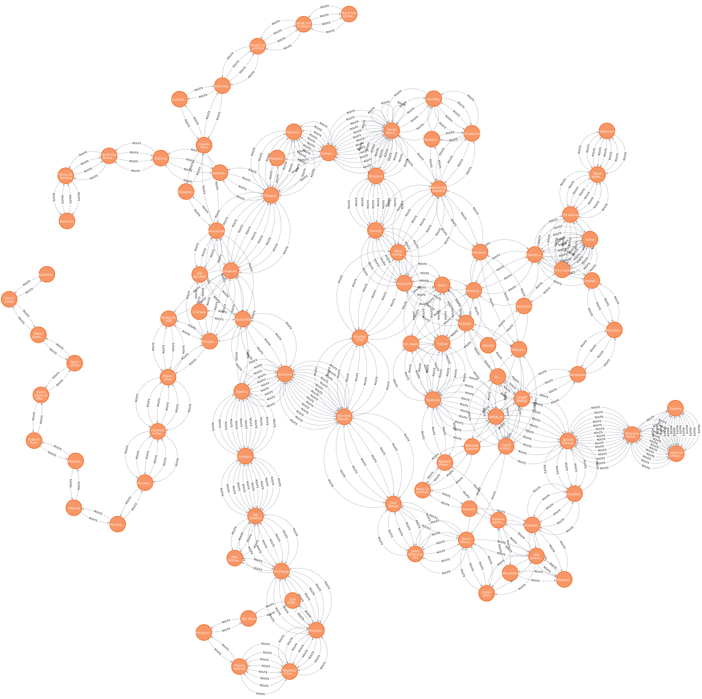

Autoři: Jakub Vlk (xvlkja07), Adam Zvara (xzvara01)

# Databáze neo4j - grafová databáze

**Název:** Zastávky MHD ve Statutárním městě Ostrava
<br>
**Odkazy:**
https://data.gov.cz/datov%C3%A1-sada?iri=https%3A%2F%2Fdata.gov.cz%2Fzdroj%2Fdatov%C3%A9-sady%2F00845451%2F37085532
<br>
**Distribuce:** GeoJSON
<br>
**Druh databáze:** neo4j
<br>
**Pro úplnost zde uvádím data tak, jak jsem je získala z Wikipedie:** V souboru `lines.txt` je seznam linek

Pro grafové databáze se hodí především data, nad kterými chceme provádět grafové algoritmy. V případě našich dat
se jedná o přirozenou reprezentaci vztahů mezi zastávkami a existujícími spoji. Neo4j má implementováno mnoho
grafových algoritmů, které můžeme využít pro analýzu dat. Díky tomu můžeme snadno zjistit například nejkratší cestu mezi
dvěma
zastávkami.

Databáze bude využita pro analýzu cestování v rámci města Ostravy, konkrétně pro zjištění existujících spojení mezi
zastávkami.
Vzhledem ke grafové povaze tohoto problému je grafová databáze ideálním řešením.

Data jsou v nestrojově čitelné podobě, proto je nutné je nejprve zpracovat. K tomuto účelu jsme
vytvořili Python script (přiložený ve složce graphdb), který data převedl do podoby Cypher scriptu pro import do
Neo4j databáze.

Informace o linkách byly využity pouze pro mapování dostupných spojení mezi zastávkami, jelikož
DPO tato data neposkytuje ve strojově čitelném formátu. Podle dostupných informací neexistují v povolených
datových sadách údaje o jízdních řádech ani o časech potřebných pro přestupy mezi linkami či zastávkami. Proto jsme
nevytvářeli vážené hrany mezi zastávkami pro realističtější vyhledávání.

Hlavní komplikací byla kvalita dat od Dopravního podniku Ostrava. Některé existující zastávky v datové sadě chyběly.
Vyskytovaly se také inconsistence v názvech zastávek (například odlišné názvy stejné zastávky pro tramvaje a autobusy -
různé mezery, zkrácené či nezkrácené varianty) a nesoulady mezi názvy v jízdních řádech a datovou sadou (ověřeno z více
zdrojů).
Problematické bylo i označení některých zastávek jako tramvajových, přestože jimi ve skutečnosti nejsou. Bylo nezbytné
data manuálně vyčistit a doplnit, což byl časově náročný proces.

**Postup pro vložení dat do neo4j databáze je následující:**

1. Parsování dat z Wikipedie
    - Pouze rozdělení jednotlivých zastávek díky `-` a následné odstranění zbytečných znaků (mezer, tabulátorů).
2. Propojení dat z Wikipedie a z dat DPO
    - Ruční kontrola a doplnění chybějících zastávek
    - Ruční kontrola a oprava názvů zastávek
    - Propojení dat z Wikipedie a z dat Dopravního podniku Ostrava
3. Vytvoření zastávek
    - Pro každou zastávku vytvořit nový uzel s názvem zastávky, souřadnicemi a informací o tom, zda je přístupná pro
      vozíčkáře.
4. Propojení všech zastávek hranou, pokud existuje cesta mezi nimi (oběma směry, aby byl graf neorientovaný).

## Vložení a definice schématu

```sql
/* Create all stops */
CREATE
CONSTRAINT stop_name IF NOT EXISTS FOR (s:Stop) REQUIRE s.name IS UNIQUE;

UNWIND
[
 {name: 'Hlavní nádraží',location: point({longitude: 18.268441009548248, latitude: 18.268441009548248}), wheelchair_accessible: False},
{name: 'Náměstí S.Čecha',location: point({longitude: 18.272677009208753, latitude: 18.272677009208753}), wheelchair_accessible: False},
{name: 'Muglinovská',location: point({longitude: 18.278012008641852, latitude: 18.278012008641852}), wheelchair_accessible: True},
       /* ... Ostaní zastávky... */
{name: 'U Hradu',location: point({longitude: 18.296669009450927, latitude: 18.296669009450927}), wheelchair_accessible: True},
{name: 'Daliborova',location: point({longitude: 18.254088009084025, latitude: 18.254088009084025}), wheelchair_accessible: False},
{name: 'Kunčičky,kostel',location: point({longitude: 18.30481100852727, latitude: 18.30481100852727}), wheelchair_accessible: False}
] AS stop

        CREATE
(s:Stop {
            name: stop.name,
            location: point({longitude: stop.longitude, latitude: stop.latitude}),
            wheelchair_accessible: stop.wheelchair_accessible
                }
                )
            WITH s
            RETURN count(*);
            
        
       
/* Create route 1 and its connections */
// Create
connections for route 1
MATCH (s0:Stop {name: 'Hlavní nádraží'})
MATCH (s1:Stop {name: 'Náměstí S.Čecha'})
MATCH (s2:Stop {name: 'Muglinovská'})
MATCH (s3:Stop {name: 'Křižíkova'})
MATCH (s4:Stop {name: 'Důl Jindřich'})
MATCH (s5:Stop {name: 'Stodolní'})
MATCH (s6:Stop {name: 'Elektra'})
MATCH (s7:Stop {name: 'Karolina'})
MATCH (s8:Stop {name: 'Náměstí Republiky'})
MATCH (s9:Stop {name: 'Don Bosco'})
MATCH (s10:Stop {name: 'Dolní Vítkovice Hlubina'})
MATCH (s11:Stop {name: 'Dolní Vítkovice'})
MATCH (s12:Stop {name: 'Český dům'})
MATCH (s13:Stop {name: 'Důl Jeremenko'})
MATCH (s14:Stop {name: 'Kolonie Jeremenko'})
MATCH (s15:Stop {name: 'Moravská'})
MATCH (s16:Stop {name: 'Dřevoprodej'})
MATCH (s17:Stop {name: 'Hrabůvka,kostel'})
MATCH (s18:Stop {name: 'Hrabůvka,Poliklinika'})
MATCH (s19:Stop {name: 'Josefa Kotase'})
MATCH (s20:Stop {name: 'Antonína Poledníka'})
MATCH (s21:Stop {name: 'Václava Jiřikovského'})
MATCH (s22:Stop {name: 'Dubina'})
CREATE
(s0)-[:ROUTE]->(s1),
(s1)-[:ROUTE]->(s0),
(s1)-[:ROUTE]->(s2),
/* ... Ostaní zastávky... */
(s21)-[:ROUTE]->(s20),
(s21)-[:ROUTE]->(s22),
(s22)-[:ROUTE]->(s21);
       

/**
 * Tímto způsobem jsme vytvořil celou grafovou strukturu.
 */

```

Výsledek je takový graf:



## Ukázka dotazu

### Nejkratší cesta mezi dvěma zastávkami

```sql
MATCH (start:Stop {name: 'Poruba,koupaliště'}), 
      (end:Stop {name: 'Osada Míru'}),
      path = shortestPath((start)-[:ROUTE*]-(end))
RETURN path
```

**Výsledek jak v textové tak grafické podobě.**


```text
╒══════════════════════════════════════════════════════════════════════╕
│path                                                                  │
╞══════════════════════════════════════════════════════════════════════╡
│(:Stop {wheelchair_accessible: true,name: "Poruba,koupaliště"})-[:ROUT│
│E]->(:Stop {wheelchair_accessible: true,name: "Poruba,Vřesinská"})-[:R│
│OUTE]->(:Stop {wheelchair_accessible: true,name: "Fakultní nemocnice"}│
│)<-[:ROUTE]-(:Stop {wheelchair_accessible: true,name: "Hlavní třída"})│
│<-[:ROUTE]-(:Stop {wheelchair_accessible: true,name: "Rektorát VŠB"})-│
│[:ROUTE]->(:Stop {wheelchair_accessible: true,name: "Telekom.škola"})<│
│-[:ROUTE]-(:Stop {wheelchair_accessible: true,name: "Třebovická"})<-[:│
│ROUTE]-(:Stop {wheelchair_accessible: true,name: "Svinov,mosty"})<-[:R│
│OUTE]-(:Stop {wheelchair_accessible: true,name: "Nová Ves,vodárna"})<-│
│[:ROUTE]-(:Stop {wheelchair_accessible: false,name: "Střelnice"})<-[:R│
│OUTE]-(:Stop {wheelchair_accessible: false,name: "Ferona"})-[:ROUTE]->│
│(:Stop {wheelchair_accessible: true,name: "Hulvácká"})-[:ROUTE]->(:Sto│
│p {wheelchair_accessible: false,name: "Dolní"})-[:ROUTE]->(:Stop {whee│
│lchair_accessible: false,name: "Tylova"})<-[:ROUTE]-(:Stop {wheelchair│
│_accessible: true,name: "Rodinná"})-[:ROUTE]->(:Stop {wheelchair_acces│
│sible: true,name: "Kpt.Vajdy"})<-[:ROUTE]-(:Stop {wheelchair_accessibl│
│e: false,name: "Rodimcevova"})-[:ROUTE]->(:Stop {wheelchair_accessible│
│: true,name: "Zábřeh,vodárna"})<-[:ROUTE]-(:Stop {wheelchair_accessibl│
│e: true,name: "Kotva"})-[:ROUTE]->(:Stop {wheelchair_accessible: true,│
│name: "Kino Luna"})<-[:ROUTE]-(:Stop {wheelchair_accessible: true,name│
│: "29.dubna"})<-[:ROUTE]-(:Stop {wheelchair_accessible: true,name: "No│
│vé Výškovice"})<-[:ROUTE]-(:Stop {wheelchair_accessible: true,name: "V│
│ýškovice"})                                                           │
└──────────────────────────────────────────────────────────────────────┘
```

### Oktužní jidza přes 3 vybrané zastávky

Zadány jsou tři zastávky a jejich pořadí průjezdu s návratem do výchozí zastávky.

```sql
MATCH (s1:Stop {name: 'Hlavní nádraží'}),
      (s2:Stop {name: 'Karolina'}),
      (s3:Stop {name: 'Dubina'}),
      p1 = shortestPath((s1)-[:ROUTE*]-(s2)),
      p2 = shortestPath((s2)-[:ROUTE*]-(s3)),
      p3 = shortestPath((s3)-[:ROUTE*]-(s1))
RETURN p1, p2, p3,
       [node IN nodes(p1) | node.name] +
       [node IN nodes(p2)[1..] | node.name] +
       [node IN nodes(p3)[1..] | node.name] AS complete_route,
       length(p1) + length(p2) + length(p3) AS total_length
```

**Výstup:**

Výsledkem je tabulka, která obsahuje jednotlivé cesty mezi zastávkami a celkovou délku cesty. Vzhledem k omezenému místu
zde ukazujeme pouze poslední sloupec.

```text

["Hlavní nádraží", "Náměstí S.Čecha", "Muglinovská", "Křižíkova", "Důl Jindřich", "Stodolní", "Elektra", "Karolina",
 "Náměstí Republiky", "Don Bosco", "Dolní Vítkovice", "Důl Jeremenko", "Dřevoprodej", "Hrabůvka,kostel", "Hrabůvka,
 Poliklinika", "Josefa Kotase", "Antonína Poledníka", "Dubina", "Antonína Poledníka", "Josefa Kotase", "Hrabůvka,
 Poliklinika", "Hrabůvka,kostel", "Dřevoprodej", "Důl Jeremenko", "Dolní Vítkovice", "Don Bosco", "Náměstí Republiky",
  "Karolina", "Elektra","Stodolní", "Důl Jindřich", "Křižíkova", "Muglinovská", "Náměstí S.Čecha", "Hlavní nádraží"]:34

```

# Databáze Cassandra - Sloupcová wide-column databáze

**Název:** Statistika průjezdu vozidel ze sledovaných křižovatek v roce 2024
<br>
**Odkazy:** https://opendata.ostrava.cz/soubory/MMOIT/doprava/Statistika-poctu-prujezdu-2024.csv
<br>
**Distribuce:** CSV
<br>
**Druh databáze:** Cassandra

Data vhodná pro wide-column databáze jsou taková, která se minimálně modifikují, ale často se z nich čte, nebo
data s velkým počtem záznamů. Výhodné je také, pokud jsou data statická nebo se téměř nemění, případně když je prioritou
rychlé vkládání hodnot a jejich čtení podle předem definovaných vzorců.

Klíčovou vlastností je jednoduché a průběžně rozšiřitelné škálování, které zajišťuje maximální výkon i
redundanci. Tu lze nastavit pomocí parametru replikace dat. Díky těmto vlastnostem Cassandra vyniká při pravidelném
přidávání
velkého množství záznamů v porovnání s tradičními relačními databázemi.

Další předností sloupcových wide-column databází je možnost jednoduchého lineárního škálování. K výhodám patří také
distribuovanost, vysoká dostupnost a odolnost proti výpadku díky distribuci dat mezi více uzly.

Významným benefitem je škálovatelnost Cassandry. S narůstajícím počtem měřicích stanic a objemem historických dat
lze snadno přidávat další uzly do clusteru. Partition key založený na časovém razítku zajišťuje rovnoměrnou
distribuci dat napříč clustery, což je zásadní pro dlouhodobou udržitelnost systému. MongoDB nebo Redis by v tomto
případě mohly být problematické - MongoDB kvůli komplexnějšímu škálování zápisů, Redis kvůli své primárně in-memory
architektuře, která by byla pro historická data nákladná.

Databáze Cassandra nabízí také TTL (Time to live) mechanismus, který umožňuje automatickou expiraci dat a jejich
agregaci pro zachování informace při současné úspoře místa.

Zvolený dataset obsahuje přes 22 tisíc záznamů. Předpokládáme, že tato data se prakticky nebudou měnit. Data budou
pouze narůstat (append only). Data obsahují informace indexované datem a časem, což je ideální pro tento typ
databází. Data mají pevnou strukturu a neobsahují prázdné hodnoty ani relační vztahy. Tato
data jsou vhodná pro sloupcové databáze. Předpokládané vyhledávání podle data a stanice odpovídá možnostem sloupcových
databází.

Způsob dotazování těchto dat je dalším důvodem pro volbu Cassandry. Většina dotazů bude směřovat na
konkrétní časové období nebo konkrétní měřicí stanici v daném čase. Cassandra tento vzor podporuje prostřednictvím
své partition key (v našem případě datum) a clustering key (stanice). Díky tomu jsou dotazy na konkrétní časový úsek
vysoce efektivní, protože Cassandra dokáže přesně lokalizovat data bez nutnosti procházet celou databázi.

__Data jsou strukturována následovně:__

- Časové razítko (datum): Primární identifikátor měření
- Lokace (stanice): Textový identifikátor místa měření
- Typ vozidla (trida_objektu): Kategorické rozlišení (Velké/Ostatní)
- Počet průjezdů (pocet): Numerická hodnota

Pro náš konkrétní případ je významné, že Cassandra umožňuje efektivní implementaci materialized views (je
nutné povolit v konfiguraci databáze).
Tím lze výrazně eliminovat nevýhodu sloupcových databází, kdy při vytvoření složitějšího dotazu je nutné
přidat za dotaz `ALLOW FILTERING`, což vede k neefektivnímu procházení všech dat s kontrolou podmínky pro každý
řádek. Materialized views umožňují tyto dotazy předpočítat a uložit do databáze.

## Vložení dat a definice schématu

Tato datová sada je dostupná pouze jako CSV. Pro vložení dat do databáze stačí vytvořit namespace,
definovat tabulku a data importovat přímo funkcí `COPY` v `cqlsh`. Lze importovat přímo z CSV souboru bez nutnosti
další algoritmické úpravy.

[//]: <> (@formatter:off)

```sql
CREATE KEYSPACE IF NOT EXISTS traffic_monitoring 
WITH replication = {
    'class': 'SimpleStrategy',
    'replication_factor': 1
};

USE traffic_monitoring;

-- Hlavní tabulka s jednoduchovou strukturou
CREATE TABLE IF NOT EXISTS traffic_measurements (
    datum timestamp,
    stanice text,
    trida_objektu text,
    pocet int,
    PRIMARY KEY ((stanice), datum)
) WITH CLUSTERING ORDER BY (datum DESC);

-- Import dat
COPY traffic_measurements (datum, stanice, trida_objektu, pocet)
FROM '/shared_data/Statistika-poctu-prujezdu-2024.csv'
WITH HEADER = TRUE
AND DELIMITER = ','
AND DATETIMEFORMAT = '%d.%m.%Y %H:%M';
  
```
    
[//]: <> (@formatter:on)

**Output:**

```text
Starting copy of traffic_monitoring.traffic_measurements with columns [datum, stanice, trida_objektu, pocet].
Processed: 22386 rows; Rate:   17053 rows/s; Avg. rate:   31068 rows/s
22386 rows imported from 1 files in 0.721 seconds (0 skipped).
```

## Ukázka dotazu

Hlavní výhoda této databáze je možnost jednoduchého přidávání uzlů do klastru (Horizontální škálování). S tímto souvisí
vysoká dostupnosta odlnost proti výpatku. Vzheldem k tomu, že jsme testovali pouze na datábázi s jedním uzlem, tak
není možné demostrovat funkce kolem redudance a distribuce zátěže což se hodí pro vysoké zátěže.

Dotaz pro získání všech měření na konkrétní stanici ve vybraných dvou dnech uskutečněných na křižovatce `Českobratrská x
Sokolská třída - od konzervatoře`

```sql
SELECT *
FROM traffic_measurements
where stanice = 'Českobratrská x Sokolská třída - od konzervatoře'
  AND datum >= '2024-01-03'
  AND datum < '2024-01-05';
```

```text

 stanice                                          | datum                           | pocet | trida_objektu
--------------------------------------------------+---------------------------------+-------+---------------
 Českobratrská x Sokolská třída - od konzervatoře | 2024-01-04 21:00:00.000000+0000 |     1 |       Ostatní
 Českobratrská x Sokolská třída - od konzervatoře | 2024-01-04 19:00:00.000000+0000 |     1 |       Ostatní
 Českobratrská x Sokolská třída - od konzervatoře | 2024-01-04 18:00:00.000000+0000 |     2 |       Ostatní
 Českobratrská x Sokolská třída - od konzervatoře | 2024-01-04 17:00:00.000000+0000 |     4 |       Ostatní
 Českobratrská x Sokolská třída - od konzervatoře | 2024-01-04 16:00:00.000000+0000 |    10 |       Ostatní
 Českobratrská x Sokolská třída - od konzervatoře | 2024-01-04 15:00:00.000000+0000 |    70 |         Velké
 Českobratrská x Sokolská třída - od konzervatoře | 2024-01-04 14:00:00.000000+0000 |    56 |         Velké
 Českobratrská x Sokolská třída - od konzervatoře | 2024-01-04 13:00:00.000000+0000 |    84 |         Velké
 Českobratrská x Sokolská třída - od konzervatoře | 2024-01-04 12:00:00.000000+0000 |   123 |         Velké
 Českobratrská x Sokolská třída - od konzervatoře | 2024-01-04 11:00:00.000000+0000 |    20 |         Velké
 Českobratrská x Sokolská třída - od konzervatoře | 2024-01-04 10:00:00.000000+0000 |    40 |         Velké
 Českobratrská x Sokolská třída - od konzervatoře | 2024-01-04 09:00:00.000000+0000 |    35 |         Velké
 Českobratrská x Sokolská třída - od konzervatoře | 2024-01-04 08:00:00.000000+0000 |    28 |         Velké
 Českobratrská x Sokolská třída - od konzervatoře | 2024-01-04 07:00:00.000000+0000 |     8 |         Velké
 Českobratrská x Sokolská třída - od konzervatoře | 2024-01-04 06:00:00.000000+0000 |     4 |       Ostatní
 Českobratrská x Sokolská třída - od konzervatoře | 2024-01-04 05:00:00.000000+0000 |     2 |         Velké
 Českobratrská x Sokolská třída - od konzervatoře | 2024-01-03 22:00:00.000000+0000 |     1 |       Ostatní
 Českobratrská x Sokolská třída - od konzervatoře | 2024-01-03 21:00:00.000000+0000 |     3 |         Velké
 Českobratrská x Sokolská třída - od konzervatoře | 2024-01-03 20:00:00.000000+0000 |     1 |         Velké
 Českobratrská x Sokolská třída - od konzervatoře | 2024-01-03 19:00:00.000000+0000 |     2 |         Velké
 Českobratrská x Sokolská třída - od konzervatoře | 2024-01-03 18:00:00.000000+0000 |     7 |       Ostatní
 Českobratrská x Sokolská třída - od konzervatoře | 2024-01-03 17:00:00.000000+0000 |     7 |       Ostatní
 Českobratrská x Sokolská třída - od konzervatoře | 2024-01-03 16:00:00.000000+0000 |    10 |         Velké
 Českobratrská x Sokolská třída - od konzervatoře | 2024-01-03 15:00:00.000000+0000 |    28 |         Velké

(24 rows)

```

# Dokumentová databáza

**Názov**: Pocitová mapa míst 2023<br>
**Odkaz**: https://opendata.ostrava.cz/soubory/DatovyPortal/pocitova_mapa_2023.csv<br>
**Distribúcia**: CSV<br>
**Druh databázy**: MongoDB<br>

Pocitová mapa miest obsahuje miesta, ktoré zaznamenali respondenti do online mapy v rámci tvorby strategického plánu mesta Ostrava.
Záznamy datasetu obsahujú povinné položky: ID užívateľa (login), súradnice miesta, mestský obvod a typ pocitu (Miesto kde sa cítim/necítim dobre,
miesto ktoré by som odporučil návštevníkom, miesto ktoré by sa malo rozvíjať). Zároveň však obsahujú aj nepovinné položky ako je komentár,
vek a pohlavie. Z toho dôvodu je vhodné využitie databázy s flexibilným schématom, ktorá umožní ukladanie dokumentov s rôznymi atribútmi a zároveň
podporuje doplnenie schématu o potenciálne zaujímavé informácie do budúcna.

Ďalší z dôvodov použitia MongoDB je horizontálna škálovateľnosť. Dataset obsahuje 24 tisíc záznamov od vyše 1000 užívateľov. V tomto prípade
nevieme odhadnúť frekvenciu zápisov (jedná sa o sumár roku 2023, záznamy nemajú časovú značku), avšak pri pravidelnom aktualizovaní (v priebehu zberu
dát pre ďalšie obdobie) by mohlo dôjsť ku zvýšeniu priestorových nárokov. MongoDB umožňuje jednoduché horizontálne škálovanie, čo znamená, že pri
zvýšení počtu dokumentov môžeme jednoducho pridať clustre a zvýšiť kapacitu databázy. Zároveň je žiadúce použitie databázy, ktorá umožňuje zmenenie
vložených dát pre prípady, kedy by užívateľ chcel zmeniť alebo doplniť informácie o mieste, ktoré zaznamenal.

V neposlednom rade je dôležité, že MongoDB podporuje geolokačné dáta a umožňuje vykonávať geografické dotazy. V tomto prípade je možné
využiť súradnice miesta na zobrazenie miest v okolí alebo na vyhľadanie miest v určitom rozsahu od zadaných súradníc. To môže slúžiť následnej
analýze dát a získaniu informácií o najfrekventovanejších miestach v okolí alebo o miestach, ktoré by mohli byť zaujímavé pre návštevníkov. Prípadne
môže byť zaujímavé filtrovanie nepríjemných miest alebo miest, ktoré by mohli byť ďalej rozvíjané a prispôsobiť plán úpravy mesta podľa požiadaviek obyvateľov (komentárov).

## Vloženie dát a definícia schématu

Dataset je dostupný iba vo formáte CSV, ktorý je podporovaný pre priame načítanie do MongoDB. Pred samotným načítaním datasetu som manuálne pozmenil názvy stĺpcov čisto
z praktického dôvodu (aby neobsahovali diakritiku a medzery). Všetky operácie nad datasetom som vykonal v docker kontajneri s aktívnou MongoDB inštanciou. Po spustení
databázy som importoval dáta z CSV súboru pomocou príkazu (`--headerline` - prvý riadok obsahuje hlavičky, `--ignoreBlanks` - ignoruje prázdne hodnoty):

```bash
mongoimport -d UPA -c pocit_mapa --type=csv --headerline --ignoreBlanks pocitova_mapa_2023.csv
```

Keďže MongoDB nedokáže automaticky rozpoznať typ súradníc z CSV súboru (ideálnejšie by bolo zvoliť GeoJSON distribúciu, ktorá však pri tomto datasete chýbala),
je potrebné ich transformovať do formátu GeoJSON. Z toho dôvodu som vytvoril nový stĺpec `location` a do neho uložil
súradnice v požadovanom formáte. Následne som vytvoril index pre rýchle vyhľadávanie podľa geolokačných dát (použité neskôr).
Tieto operácie som vykonal priamo v `mongosh`:

```
db.pocit_mapa.updateMany({}, [{ $set: { location: { type: "Point", coordinates: [ "$X", "$Y"]}}}])
db.pocit_mapa.createIndex({ location: "2dsphere" })
```

## Ukážka dotazov

Následne je možné vykonávať rôzne dotazy nad dátami, k čomu je praktické využitie agregačnej pipeline. V následujúcom príklade zisťujem počet recenzií jednotlivých typy pocitov
v okruhu konkrétneho miesta (napr. 100 metrov - môžeme prakticky považovať za jednu lokalitu). Výsledok je zoradený podľa počtu recenzií zostupne:

```
db.pocit_mapa.aggregate([
    {
        $geoNear: {
            near: { type: "Point", coordinates: [18.273579, 49.850449] },         /* súradnice miesta */
            distanceField: "distance",
            maxDistance: 100,                                                     /* 100 metrov */
            spherical: true                                                       /* použitie 2dsphere indexu */
        }
    },
    {
        $group: {
            _id: "$Pocit",                                                        /* zoskupenie podľa typu pocitu */
            count: { $count: {} }
        }
    },
    {
        $sort: {                                                                  /* zoradenie podľa počtu recenzií */
            count: -1
        }
    }
])
```

**Output:**

```bash
[
  { _id: 'Místo, kde se necítím dobře', count: 200 },
  { _id: 'Místo, které by se mělo rozvíjet', count: 74 },
  { _id: 'Místo, které doporučím návštěvníkům', count: 19 },
  { _id: 'Místo, kde se cítím dobře', count: 8 }
]
```

V závislosti od používania databázy by bolo praktické vytvoriť indexy aj nad inými poliami databázy, napr. `login` pre jednoduché vyhľadanie komentárov od užívateľa v
prípade, ak by ich chcel zmeniť alebo index nad `pocit` v kombinácií s `komentar` (jeho existencia) v prípade častého dotazovania sa na navrhované zmeny, ktoré
potom môžeme využiť pri tvorbe plánu rozvoja mesta. Príklad takéhoto využitia je v pozmenení predcházajúcej agregačnej pipeline, kde zobrazujeme komentáre k miestam,
ktoré by sa mali rozvíjať.

```
{
    $match: {
        Komentar: {$exists: true},                          /* filtrovanie príspevkov s komentárom */
        Pocit: "Místo, které by se mělo rozvíjet"           /* filtrovanie podľa typu pocitu */
    }
},
{
    $project: {
        _id: 0,                                             /* nezobrazovanie ID */
        Komentar: 1                                         /* zobrazenie komentára */
    }
}
```

**Output:**

```bash
[
  { Komentar: 'Zastávka Náměstí republiky' },
  { Komentar: 'Pokud "není možná" likvidace a návrat k historickému úrovňovému řešené ulice...'},
  { Komentar: 'Myslím, že už je to v plánu, ale Frýdlanstké mosty jsou v hrozném stavu, přstupní uzel, aktuálně nereprezuntující...' }
]
```

# Databáza časových radov

**Názov**: Dopravní přestupky dle data a místa spáchání v roce 2024<br>
**Odkaz**: https://opendata.ostrava.cz/soubory/DatovyPortal/prestupky/20240101_20240630_dopravniprestupky.csv<br>
**Distribúcia**: CSV<br>
**Druh databázy**: InfluxDB<br>

Dataset dopravných priestupkov spáchaných v roku 2024 obsahuje záznamy o priestupkoch, ktoré boli zaznamenané políciou v Ostrave. Pre
tento dataset sme zvolili databázu časových radov InfluxDB, ktorá je špeciálne navrhnutá pre ukladanie časových dát a ich analýzu.
Pri výbere vhodného datasetu pre túto databázu sme si uvedomovali, že tento dataset nemusí nevyhnutne predstavovať
najlepšie vyhovujúci príklad pre InfluxDB, avšak neboli sme schopní z voľne dostupných dát nájsť vhodnejší dataset (napríklad
merania z rôznych senzorov, pre ktoré by bola táto databáza vhodnejšia).

Záznamy datasetu sú vo formáte CSV a obsahujú následujúce informácie:
  - Číslo prípadu
  - Miesto priesupku (voľný text)
  - Identifikácia priestupku: číslo zákona, paragraf, odstavec, písmeno a bod
  - Dátum spáchania: deň, mesiac a rok

Využitie vlastností InfluxDB spočíva v možnosti rýchleho filtrovania a zoskupovania dát podľa časových značiek a ďalších atribútov, ktoré si
definujeme v následujúcej sekcii. Zároveň dataset obsahuje nemalé množstvo záznamov (cca 30 tisíc), pre ktoré je použitie distribuovanej
databázy vhodné.

## Vloženie dát a definícia schématu

V prvom rade je nutné prevedenie CSV formátu do Influx line protokolu pomocou priloženého skriptu `csv_to_influx.py`. Pred samotným
prevedením sme manuálne upravili chyby vyskytujúce sa v datasete, kvôli ktorým nemohol byť automaticky spracovaný alebo načítaný do
databázy. Medzi tieto chyby patrili:
  - chybný dátum: `0202-05-16` pre prípad s číslom `23945` (záznam sme vymazali)
  - miesto činu obsahuje (neescapnuté) úvodzovky a poruší automatizované spracovanie: `" v Ostravě na ulici Hlučínská /autobusová zastávka "Přívoz\,Hllučínská"/"` - čísla prípadov `7390`, `28975` (zo záznamov sme odstránili úvodzovky)
  - text v čísle prípadu: `10888-P` (zo záznamu sme odstránili `-P`)

Zaroveň sme transformovali dátum do formátu Unix časovej značky (v sekundách). V neposlednom rade je dôležité si premyslieť rozloženie jednotlivých
atribútov do tagov a fieldov. Zvolili sme variant, kde `measurement` obsahuje základné parametre typu priestupku, ktoré sú tvorené
trojicou `cislo_zakona-paragraf-odstavec`. Teda napríklad:
  - `361/2000-125c-1` - priestupok fyzickej osoby na premávke na pozemnej komunikácii
  - `361/2000-125f-1` - priestupok prevozovateľa vozidla
  - `168/1999-16-1` - porušenie registrácie vozidla

V prípade, že zákon je ďalej špecifikovaný písmenom a bodom, môžeme tieto informácie zahrnúť do tagov pre lepšie zoskupovanie a
filtrovanie (nie každý measurement obsahuje tieto tagy). Príkladom môže byť zákon `361/2000-125c-1`, ktorý môže byť ďalej
konkretizovaný na činy:
  - `pismeno=f,bod=2` - prekročenie rýchlosti o 40 km/h v obci alebo 50 km/h mimo obce
  - `pismeno=f,bod=3` - prekročenie rýchlosti o 20 km/h v obci alebo 30 km/h mimo obce
  - `pismeno=f,bod=8` - nedatie prednosti v jazde
  - `pismeno=i,bod=1` - nezastavenie vozidla na znamenie policajta

Každý záznam napokon obsahuje field `miesto` a `cislo_pripadu`. Teda celkový príklad záznamu v Influx Line protokole môže vyzerať nasledovne:

```
361/2000-125c-1,pismeno=k,bod=0 misto_cinu="v Klimkovicích po ulci Lidické, zastávka MHD",cislo_pripadu=0014 1698620400
```

Je zrejmé, že existuje viacero možností ako vytvoriť schéma databázy v závislosti od jej použitia. V tomto prípade sme sa rozhodli
pre variant, ktorý umožňuje rýchle filtrovanie a zoskupovanie podľa typu priestupku (tagy, nad ktorými je vytvorený index) ale napríklad neumožňuje
zoskupovanie podľa miesta činu (field). V prípade, že by sme chceli zoskupovať podľa miesta, mohli by sme zvoliť variant, kde `misto_cinu` je tag
a `cislo_pripadu` je field.

Všetky operácie nad datasetom sme vykonali v docker kontajneri s aktívnou InfluxDB inštanciou (verzia 1.8.10 kompatibilná s príkladmi
z prednášok). Po spustení databázy sme vytvorili databázu `driving_tickets`:

```bash
influx -execute 'CREATE DATABASE driving_tickets'
```

Následne môžeme importovať dáta z prevedeného CSV súboru (vznikol z `csv_to_influx.py`):

```bash
root@e5bc91132687:/# influx -import -path=tickets.txt -precision=s -database=driving_tickets
2024/11/02 16:55:31 Processed 1 commands
2024/11/02 16:55:31 Processed 29736 inserts
2024/11/02 16:55:31 Failed 0 inserts
```

## Ukážka dotazov

Nad dátami následne vieme realizovať rozličné dotazy, napríklad na vypísanie miest všetkých priestupkov spojených s prekročením rýchlosti
v máji (5. mesiac) 2024 (realizované v InfluxQL):

```sql
SELECT misto_cinu FROM "361/2000-125c-1" WHERE pismeno='f' AND (bod='2' OR bod='3' OR bod='4') AND time > '2024-05-01 00:00:00' AND time < '2024-05-31 23:59:59'
```

**Output:**

```
2024-05-01T22:00:00Z na dálnici D1 v 366,9 km ve směru jízdy na Brno
2024-05-02T22:00:00Z na dálnici D1 na 367 km ve směru na Brno
2024-05-02T22:00:00Z č.p. 134/25, přechod
...
```

Prípadne nás môže zaujímať celkový počet prípadov prerušenia pravidiel premávky v jednotlivých mesiacoch na prelome rokov 2023/2024:

```sql
SELECT count(cislo_pripadu) FROM "361/2000-125c-1" WHERE time > '2023-08-01' GROUP BY time(4w)
```

**Output:**

```
2023-07-06T00:00:00Z 0
2023-08-03T00:00:00Z 4
2023-08-31T00:00:00Z 15
2023-09-28T00:00:00Z 11
2023-10-26T00:00:00Z 49
2023-11-23T00:00:00Z 155
2023-12-21T00:00:00Z 195
2024-01-18T00:00:00Z 249
2024-02-15T00:00:00Z 266
2024-03-14T00:00:00Z 240
2024-04-11T00:00:00Z 227
2024-05-09T00:00:00Z 221
2024-06-06T00:00:00Z 23
...
```


## Poznámky:

Jen pro uplnost zde uvadíme, že jsem testovali na jednom uzlu, v docker instancích. V přílušných složkách jsou bud
docker-compose nebo jsem používali přímo docker příkazy pro spuštění instancí.


