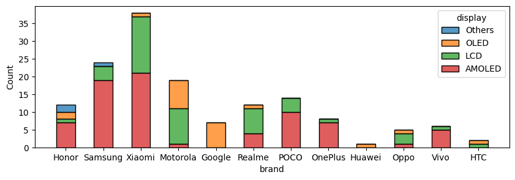
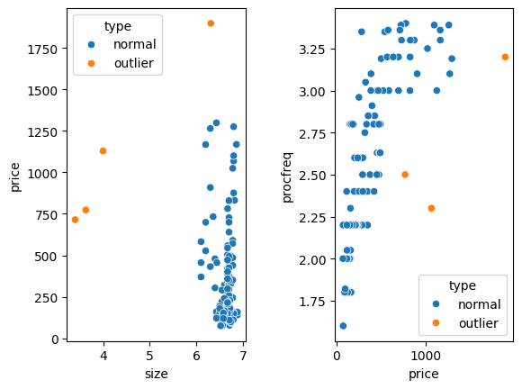

# Príprava dát a ich popisná charakteristika

Autori: Adam Zvara (xzvara01), Jakub Vlk (xvlkja07) 

# Exploratívna analýza

V tomto projekte pracujeme nad datasetom obsahujúcim informácie o predávaných mobilných zariadeniach v rámci elektronického obchodu.
Pred popisom atribútov a exploratívnou analýzou sme sa rozhodli mierne upraviť dataset kvôli sprehľadneniu vizualizácií a rozšírenej možnosti analýzy, ktorú sme pri vytváraní datasetu neuvažovali. V prvom rade sme zaviedli nový atribút obsahujúci značku zariadenia (Xiaomi, Samsung, ...), ktorý sme získali z názvu zariadenia (prvé slovo názvu, ktorý je napríklad "Xiaomi Redmi 12 Dual SIM"). Druhá úprava spočíva v spojení podobných typov displejov, keďže pôvodne obsahoval až 21 unikátnych hodnôt, čo sťažuje ich analýzu a vizualizáciu. Po úprave dataset obsahuje 4 typy displejov: AMOLED, OLED, LCD a *Ostatné*.

Dataset obsahuje 150 záznamov s nasledujúcimi atribútmi (vynechali sme atribúty URL a názov zariadenia, ktoré boli potrebné v prvej časti projektu, *Q* značí kvantitatívny a *C* kategorický atribút):

|      **atribút**     |   **typ**  | **počet** |          **rozsah**          | **priemer** | **median** |  **modus** |
|:--------------------:|:----------:|:---------:|:----------------------------:|:-----------:|:----------:|:----------:|
| cena                 | Q - float  |    150    |        74.3 - 1898.8         |    361.9    |    240.3   |    119.8   |
| veľkosť displeju     | Q - float  |    148    |         3.4 - 6.88           |     6.56    |    6.67    |    6.67    |
| kapacita batérie     | Q - int    |    148    |         3700 - 6000          |   4966.77   |    5000    |    5000    |
| frekvencia procesoru | Q - float  |    147    |          1.6 - 3.4           |     2.5     |     2.4    |     2.2    |
| rozlíšenie kamery    | Q - int    |    148    |           8 - 200            |    64.82    |     50     |     50     |
| technológia displeju | C - string |    148    | {AMOLED, OLED, LCD, Ostatné} |      -      |      -     |   AMOLED   |
| značka               | C - string |    150    |    {Google, Samsung, ...}    |      -      |      -     |    Xiaomi  |

## Analýza rozloženia hodnôt atribútov

Dataset obsahuje 5 kvantitatívnych atribútov, ktorých rozloženia môžeme spoločne zobraziť pomocou skupiny husľových grafov. Z týchto grafov vieme napríklad vyčítať najväčšie koncentrácie hodnôt - cena okolo 250 eur, veľkosť okolo 6.5 palcov, kapacita batérie je vysoko koncentrovaná na hodnote 5000 (na grafe nevidíme q1 a q3 interval), frekvencia procesoru je najrovnomernejšie rozložená spomedzi všetkých atribútov s najvyššou koncentráciou okolo 2.2 GHz a napokon rozlíšenie kamery je najviac rozložené okolo hodnoty 50 MPx. Zároveň si môžeme všimnúť, že atribút frekvencie procesoru obsahuje najmenej odľahlých hodnôt.

Podobne si vieme zobraziť aj kategorické hodnoty pomocou histogramov. Na ich vizualizáciu sme vybrali kombinovaný histogram, kde pre každú značku zariadenia zobrazujeme aj typ displeju. Z grafu teda vieme vyčítať, že najčastejšie značky telefónov sú Xiaomi, Samsung a Motorola. Medzi displejovými technológiami dominujú AMOLED a LCD.

Prvá otázka, ktorá nám môže napadnúť je ktorý atribút najviac vplýva na cenu zariadenia. Odpoveď na túto otázku budeme bližšie analyzovať pri korelačnej analýze. Môžeme však odhadnúť, že procesor, ktorý je jeho najdrahšou  súčiastkou, môže mať drastický vplyv na cenu zariadenia. Vzťah týchto dvoch kvantitatívnych atribútov (teda frekvenciu procesoru a cenu zariadenia) si môžeme zobraziť pomocou 2D bodového grafu. Z neho vidíme potenciálnu koreláciu a zároveň vidíme, že frekvencie procesorov sú často usporiadané v stĺpcoch (frekvencie procesorov najčastejšie výrobcovia udávajú na tabuľkové hodnoty, ktoré zaokrúhľujú).

Rozloženie 3 atribútov môžeme vizualizovať napríklad pomocou kombinovaného grafu. Na obrázku nižšie vidíme rozloženia kapacity batérie a frekvencie procesoru, kde sme navyše zakomponovali informáciu o typu displeja ako farbu jednotlivých bodov grafu. Zároveň na krajných osách vidíme aj rozloženia hustoty pre jednotlivé numerické atribúty v závislosti od displeja. Z grafu vieme dominantné hodnoty pre kapacitu batérie (5000 mAh - usporiadané v stĺpci) a zároveň vidíme, že pravdepodobne nebude existovať závislosť medzi týmito kvantitatívnymi atribútmi. Pomocou rozloženia hustôt si však môžeme všimnúť, že telefóny s LCD displejmi majú tendenciu mať nižšiu frekvenciu procesoru. 

Ďalej sme sa pozreli na možnosti skúmania vplyvu kategorického atribútu na kvantitatívny - v tomto prípade značky telefónu na jeho cenu. Na vizualizáciu sme použili niekoľko krabicových grafov pre jednotlivé značky zariadení, ktoré sme zoradili vzostupne podľa mediánu. Z grafu vieme vyčítať, že značka Xiaomi sa sústredí najmä na nižšie cenové kategórie ale obsahuje aj niekoľko vlajkových lodí (*flagships* - drahých zariadení). Naopak Google alebo OnePlus sa sústredia na vyššie cenové kategórie a značka Samsung poskytuje zariadenia s najväčším cenovým výberom.

## Korelačná analýza atribútov

Z prvotnej analýzy môžeme usúdiť, že v datasete sa pravdepodobne nachádzajú korelované atribúty. V úvode korelačnej analýzy sme si zobrazili maticu grafov pre všetky numerické atribúty so zakomponovaným atribútom displeju. Z bodových grafov vidíme už objavenú koreláciu medzi cenou zariadenia a frekvenciou procesoru. Z grafov rozloženia distribúcií si však môžeme všimnúť, že pravdepodobne existuje aj korelácia medzi typom displeju a jeho cenou alebo frekvenciou procesoru (najmä pri LCD displejoch v porovnaní s ostatnými). 

Rozhodli sme sa bližšie preskúmať vzťah ceny a frekvencie procesoru, a to konkrétne pomocou Pearsonovho korelačného koeficientu, keďže sa jedná o numerické atribúty. Pearsonov koeficient má hodnotu 0.75, čo naznačuje silnú pozitívnu koreláciu. Zároveň sme realizovali Spearmanov test, kde sme predpokladali, že jeho hodnota bude ešte vyššia, pretože testuje monotónnosť vzťahu (a vzťah z grafu pravdepodobne nie je čisto lineárne závislý). Hodnota Spearmanovho koeficientu pre skúmané atribúty je 0.86, čo taktiež naznačuje pozitívnu koreláciu. 

Vzťahy medzi kategorickými a numerickými atribútmi sme skúmali pomocou krabicových grafov, na ktorých sme si zobrazili rozloženie cien a frekvencií procesorov pre jednotlivé typy displejov. Z grafu jasne vidíme, že LCD technológia je najčastejšie používaná pri lacnejších zariadeniach, kdežto OLED je používaný typicky pri drahších zariadeniach. AMOLED je používaný pri zariadeniach s cenou v strede cenového spektra. Podobne pri zobrazení vzťahu typu displeja a frekvencie zariadenia vidíme, že zariadenia používajúce LCD displej disponujú výrazne nižšou frekvenciou procesoru.

Nakoniec sme vypočítali korelačnú maticu pre všetky numerické atribúty, keďže vizuálne nemusíme byť schopní odhaliť všetky vzťahy medzi premennými. Z matice vieme vyčítať, že existuje stredne silná korelácia medzi kapacitou batérie a veľkosťou telefónu, kde hodnota korelačného koeficientu je 0.51. Existujú aj slabé (negatívne) vzťahy medzi cenou a veľkosťou/kapacitou batérie zariadenia s hodnotami okolo -0.25. 

## Analýza chýbajúcich hodnôt

Následne sme v datasete skúmali výskyty chýbajúcich hodnôt. Zistili sme, že v datasete sa nachádzajú dva záznamy s veľkým množstvom chýbajúcich hodnôt (5 atribútov) a jeden záznam s jednou chýbajúcou hodnotou (frekvencia procesoru). Tento dataset je teda pomerne čistý a neobsahuje veľké množstvo chýbajúcich hodnôt. 

| **index** |           **name**          | **price** | **size** | **battery** | **procfreq** | **resolution** | **display** |  **brand** |
|:---------:|:---------------------------:|:---------:|:--------:|:-----------:|:------------:|:--------------:|:-----------:|:----------:|
|     29    |   Xiaomi Redmi 13 Dual SIM  |   150.4   |    NaN   |     NaN     |      NaN     |       NaN      |     NaN     |   Xiaomi   |
|     43    |     Oppo A79 5G Dual SIM    |   170.8   |   6.72   |    5000.0   |      NaN     |      50.0      |     LCD     |    Oppo    |
|    122    | ThinkPhone/8GB/256GB/Carbon |   599.0   |    NaN   |     NaN     |      NaN     |       NaN      |     NaN     | ThinkPhone |

## Detekcia odľahlých hodnôt

V neposlednom rade sme sa pozreli na detekciu odľahlých hodnôt, na ktorú sme využili dve metódy: *z-score* normalizáciu a *clustering*.

Z-score normalizácia je štandardná metóda transformácie dát do nového rozsahu hodnôt, aby po transformácii dosahovali hodnoty &mu; = 0 a &sigma; = 1. Na základe tejto transformácie je možné identifikovať potenciálne odľahlé hodnoty, ktoré sa nachádzajú mimo intervalu daného smerodajnou odchýlkou (napr. pre normálne rozdelenie je 99.7% hodnôt v intervale 3&sigma;). Na identifikáciu odľahlých hodnôt sme použili interval 3&sigma;. Výsledky sú zobrazené v tabuľke nižšie (v poslednom stĺpci *outlier_variables* je premenná, kvôli ktorej bol záznam označený ako odľahlá hodnota). Celkovo bolo touto metódou nájdených 12 záznamov. Je však diskutabilné, či sa jedná o skutočné odľahlé hodnoty, napríklad 7 záznamov obsahuje rozlíšenie pohybujúce sa okolo hodnoty 200. Keďže je týchto záznamov pomerne veľa a veľkosť displeju nemusí splňovať normálne rozloženie, tieto záznamy by sme nemuseli považovať za odľahlé. Metóda však našla aj odľahlé hodnoty v iných atribútoch, ako je napríklad veľkosť zariadenia, kde boli nájdené tri záznamy s malou veľkosťou (okolo 3.5 palca) alebo dva záznamy s veľkou cenou (nad 1200 eur). Keďže týchto záznamov nie je veľa a ich hodnoty by mohli vplývať na rôzne typy dolovacích úloh, môžeme ich považovať za odľahlé hodnoty. 

| **index** | **price** | **size** | **battery** | **procfreq** | **resolution** | **display** | **brand** | **outlier_variables** |
|:---------:|:---------:|:--------:|:-----------:|:------------:|:--------------:|:-----------:|:---------:|:---------------------:|
|     6     |   340.7   |   6.67   |    5000.0   |     2.80     |      200.0     |    AMOLED   |   Xiaomi  |      _resolution_     |
|     8     |   214.9   |   6.67   |    5000.0   |     2.20     |      200.0     |    AMOLED   |   Xiaomi  |      _resolution_     |
|     22    |   272.6   |   6.67   |    5000.0   |     2.60     |      200.0     |    AMOLED   |   Xiaomi  |          ...          |
|     52    |   773.4   |   3.63   |    4200.0   |     2.50     |      50.0      |     OLED    |  Motorola |         _size_        |
|     57    |   1129.3  |   4.00   |    4000.0   |     3.00     |      50.0      |     OLED    |  Motorola |         _size_        |
|    113    |   714.7   |   3.40   |    3700.0   |     3.36     |      12.0      |    AMOLED   |  Samsung  |         _size_        |
|     78    |   1298.8  |   6.43   |    5000.0   |     3.19     |      50.0      |     OLED    |   Honor   |        _price_        |
|     90    |   1898.8  |   6.31   |    4805.0   |     3.20     |      64.0      |    AMOLED   |  OnePlus  |        _price_        |

Druhou metódou na detekciu odľahlých hodnôt je zhlukovanie (*clustering*), ktoré zaraďuje dáta do tried na základe spoločných vlastností.
Keďže clustering je pomerne zložitou metódou citlivou na výber hyperparametrov a dimenzionalitu dát, rozhodli sme sa ho demonštrovať na jednoduchom príklade s  použitím algoritmu *K-Means* pre nami vybrané dvojice atribútov (vybrali sme na základe bodových grafov). Zhlukovanie je citlivé na hodnoty v rozličných rozsahoch, preto je nutné vybrané atribúty normalizovať. Na detekciu odľahlých hodnôt sme si vybrali dvojice atribútov (veľkosť displeja, cena) s počtom clusterov 5 a (cena, frekvencia procesoru) s počtom clusterov 8. Na grafe vidíme detekované odľahlé hodnoty, kde kritérium pre označenie záznamu ako odľahlej hodnoty je počet záznamov v clusteri (v oboch prípadoch hodnota 4). 

Detekované záznamy sú zobrazené v tabuľke nižšie. Vidíme, že táto metóda našla rovnaké záznamy ako metóda z-score (s výnimkou záznamov s odľahlými hodnotami v rozlíšení a jedným zariadením s cenou zariadenia).

| **index** | **price** | **size** | **battery** | **procfreq** | **resolution display** | **brand** | **brand** |
|:---------:|:---------:|:--------:|:-----------:|:------------:|:----------------------:|:---------:|:---------:|
|     52    |   773.4   |   3.63   |    4200.0   |     2.50     |          50.0          |    OLED   |  Motorola |
|     57    |   1129.3  |   4.00   |    4000.0   |     3.00     |          50.0          |    OLED   |  Motorola |
|     90    |   1898.8  |   6.31   |    4805.0   |     3.20     |          64.0          |   AMOLED  |  OnePlus  |
|    113    |   714.7   |   3.40   |    3700.0   |     3.36     |          12.0          |   AMOLED  |  Samsung  |

# Príprava datasetov pre dolovacie úlohy

## Dataset 1

Ako prvú dolovaciu úlohu sme uvažovali predikciu ceny na základe vlastností zariadenia. Z exploratívnej analýzy sme zistili, že najväčší vplyv na cenu zariadenia má jednoznačne frekvencia procesoru, ale aj technológia displeja spolu so značkou výrobcu. V datasete sme teda ponechali iba tieto atribúty (spolu s cenou ako cieľovým atribútom).

### Chýbajúce hodnoty

Z exploratívnej analýzy sme našli trojicu záznamov s chýbajúcimi hodnotami. Naším cieľom bolo doplniť hodnoty chýbajúcich atribútov zo stredných hodnôt zariadenia pre danú značku. Problémom v tomto prístupe je však zariadenie ThinkPhone, ktoré je jediné v rámci daného výrobcu. Z toho dôvodu sme sa rozhodli tento záznam odstrániť. 

| **index** | **price** | **procfreq** | **display** |  **brand** |
|:---------:|:---------:|:------------:|:-----------:|:----------:|
|     29    |   150.4   |      NaN     |     NaN     |   Xiaomi   |
|     43    |   170.8   |      NaN     |     LCD     |    Oppo    |
|    122    |   599.0   |      NaN     |     NaN     | ThinkPhone |

Jeden záznam (index 43) obsahuje chýbajúcu frekvenciu procesoru a je od výrobcu Oppo. Chýbajúcu hodnotu sme doplnili priemernou hodnotou frekvencie procesoru pre zariadenia od výrobcu Oppo (2.35 GHz). Ďalší záznam (index 29) obsahoval 2 chýbajúce hodnoty: frekvenciu procesoru a typ displeju. Frekvenciu sme doplnili rovnakým spôsobom (priemer frekvencie pre Xiaomi je 2.43 GHz) a typ displeju sme doplnili najčastejšou hodnotou pre zariadenia od výrobcu Xiaomi (AMOLED).

### Odľahlé hodnoty

Pre získanie odľahlých hodnôt sme použili metódu z-score, ktorá našla nasledujúce záznamy:

| **index** | **price** | **procfreq** | **display** | **brand** |
|:---------:|:---------:|:------------:|:-----------:|:---------:|
|     78    |   1298.8  |     3.19     |     OLED    |   Honor   |
|     90    |   1898.8  |     3.20     |    AMOLED   |  OnePlus  |

Záznamy sú považované za odľahlé kvôli ich vysokým cenám. Dôvod vysokej ceny môže byť rôzny, napríklad zariadenie môže obsahovať špeciálne funkcie, ktoré sme pri zbere dát nezaznamenali. Rozhodli sme sa ich odstrániť z datasetu kvôli tomu, že by mohli ovplyvniť výsledky dolovacej úlohy.

### Diskretizácia numerických atribútov

Zadanie projektu špecifikuje, že v jednom z datasetov je potrebné diskretizovať numerické atribúty. Náš dataset obsahuje iba jeden numerický atribút - frekvenciu procesoru (ak neuvažujeme cieľový atribút ceny). Rozhodli sme sa tento atribút diskretizovať do 5 intervalov: 
  - veľmi nízky - rozsah `(1.59, 1.96>`
  - nízky - rozsah `(1.96, 2.32>`
  - stredný - rozsah  `(2.32, 2.68>`
  - vysoký - rozsah   `(2.68, 3.04>`
  - veľmi vysoký - rozsah  `(3.04, 3.4>`

Výsledný dataset sme uložili do súboru `dataset1.csv`.

 
 
 

## Dataset 2

Ako druhú dolovaciu úlohu sme uvažovali hľadanie skupín podobných výrobkov na základe ich vlastností. Rozhodli sme sa z datasetu vypustiť 
atribúty ceny a výrobcu a hľadať zariadenia, ktoré majú spoločné vlastnosti v rámci veľkosti displeja, kapacity batérie, frekvencie procesoru, rozlíšenia kamery a typu displeja.

### Chýbajúce hodnoty

Chýbajúce hodnoty sú rovnaké ako pri prvom datasete s tým rozdielom, že tentokrát neuvažujeme informáciu o značke zariadenia. Z tohoto dôvodu sme sa rozhodli odstrániť záznamy s viac ako 2 chýbajúcimi hodnotami (index 29 a 122). Záznam s jedinou chýbajúcou hodnotou (index 43) sme doplnili priemernou hodnotou frekvencie procesoru pre všetky zariadenia (2.5 GHz).

### Odľahlé hodnoty

Na detekciu odľahlých hodnôt sme opäť použili metódu z-score, ktorá našla podobné záznamy ako v exploratívnej analýze (okrem záznamov, kde odľahlý atribút je cena, keďže ju neuvažujeme). Z dôvodov popísaných v exploratívnej analýze sme sa rozhodli odstrániť záznamy, kde rozhodujúcim atribútom je veľkosť a ponechať záznamy, kde je odľahlým atribútom rozlíšenie kamery.

### Transformácia kategorických atribútov na numerické

Zadanie definuje, že v druhom datasete je potrebné transformovať kategorické atribúty na numerické. V našom datasete máme jeden kategorický atribút - typ displeja. Keďže sa jedná o nominálny atribút (nemá definované poradie), rozhodli sme sa ho transformovať pomocou *one-hot encoding*, ako je vyobrazené v nasledujúcej tabuľke:

| **index** | **size** | **battery** | **procfreq** | **resolution** | **AMOLED** | **LCD** | **OLED** | **Others** |
|:---------:|:--------:|:-----------:|:------------:|:--------------:|:----------:|:-------:|:--------:|:----------:|
|     0     |   6.80   |    5600.0   |     3.30     |      180.0     |     _0_    |   _0_   |    _1_   |     _0_    |
|     1     |   6.60   |    5000.0   |     2.75     |      50.0      |     _1_    |   _0_   |    _0_   |     _0_    |
|     2     |   6.50   |    5000.0   |     2.40     |      50.0      |     _1_    |   _0_   |    _0_   |     _0_    |
|    ...    |    ...   |     ...     |      ...     |       ...      |     ...    |   ...   |    ...   |     ...    |

Ďalej je potrebné normalizovať numerické atribúty do intervalu <0,1> alebo prípadne <-1,1>. Konkrétne je nutné normalizovať atribúty
veľkosť displeja, kapacitu batérie, frekvenciu procesoru a rozlíšenie kamery. Normalizáciu pre všetky tieto atribúty sme vykonali pomocou *min-max* normalizácie do intervalu <0,1>.

| **index** |  **size**  | **battery** | **procfreq** | **resolution** | **AMOLED** | **LCD** | **OLED** | **Others** |
|:---------:|:----------:|:-----------:|:------------:|:--------------:|:----------:|:-------:|:--------:|:----------:|
|     0     | _0.897436_ |  _0.809524_ |  _0.944444_  |   _0.895833_   |      0     |    0    |     1    |      0     |
|     1     | _0.641026_ |  _0.523810_ |  _0.638889_  |   _0.218750_   |      1     |    0    |     0    |      0     |
|     2     | _0.512821_ |  _0.523810_ |  _0.444444_  |   _0.218750_   |      1     |    0    |     0    |      0     |
|    ...    |     ...    |     ...     |      ...     |       ...      |     ...    |   ...   |    ...   |     ...    |

Výsledný dataset sme uložili do súboru `dataset2.csv`.